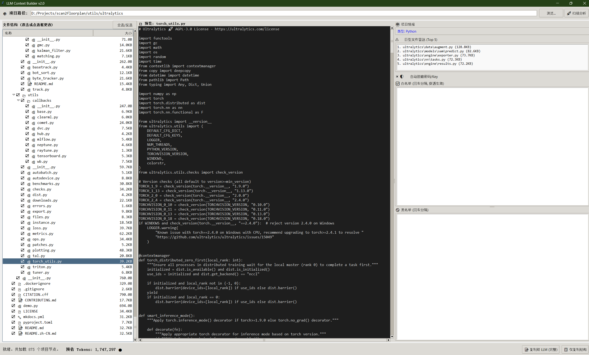

# ProjectReader for LLMs
> **The Ultimate Zero-Dependency Codebase Packer for LLMs.**
> 
> 停止无意义的复制粘贴。一键将你的本地项目打包成完美的 LLM 上下文。

[](https://www.python.org/)
[]()
[]()

### 💡 为什么造这个轮子？
在使用 ChatGPT / Claude / DeepSeek 等大模型辅助编程时，我受够了：
* 手动挨个打开文件，复制粘贴代码？
* 直接把整个目录扔给大模型，结果 `node_modules` 或大文件直接导致 Token 爆炸？
* LLM 被大量无用的业务逻辑干扰，抓不住项目整体架构？

所以我造了这个轮子...

**ProjectReader for LLMs** 是一个 **100% 零依赖** 的单文件脚本，允许 零 环境的纯净Python以GUI形式读取你的项目，并以LLM友好地Markdown形式总结和形成上下文。

 

---

### 有些什么特点？

* **绝对零依赖 (Zero-Dependency)**
  * 只有一个 `.py` 文件。纯 Python 标准库编写 (`Tkinter`, `os`, `re`, `ast`...)。
  * **无需 `pip install`**。下载即用，用完即走，不污染开发环境。
* **智能骨架提取 (Skeleton Mode)**
  * 万行巨型 `utils.py` 太费 Token？右键开启「骨架模式」。
  * 瞬间抹除所有函数实现，**仅保留 Class 结构、函数签名和类型注解**
* **硬核过滤策略 (Smart Penetration)**
  * 自动识别 Vue/Python/Java/Rust 项目，预设忽略垃圾目录。
  * **原声解析 `.gitignore`**，Git 忽略什么，它就忽略什么。
  * **白名单刺透机制**：即使父目录被黑名单封杀，只要命中白名单，依然能从深处将文件精准“捞”出。
* **简洁的GUI**
  * 经典的左中右三栏布局：**三态目录树** + **实时所见即所得预览** + **Token 雷达**。
  * 自动拦截巨大文件并截断，防止 IDE 卡死或 Token 超载。
* **本地脱敏 (Secret Redaction)**
  * 复制前自动扫描，将疑似硬编码的 `api_key`、`password` 替换为 `[REDACTED_SECRET]`，安全第一。
  * 你也可以编写自己的安全策略，保证敏感内容不泄露，尽管是发给LLM的。

---

### 🚀 极速起步

你可以克隆仓库，或者干脆只直接下载这一个文件：

```bash
# 1. 下载单文件脚本
curl -O https://github.com/SCWM-P/ProjectReader/main/ProjectReader.py

# 2. 直接运行
python ProjectReader.py
```
*(就这么简单。)*

### 📝 导出格式预览

一键点击 `[复制给 LLM]` 后，剪贴板会得到高度标准化的 Markdown：

```markdown
# Project Context: my_awesome_project
## 1. Directory Structure
```plaintext
my_awesome_project/
├── main.py
├── core/
│   └── processor.py [骨架]
└── README.md
```

## 2. File Contents

### File: `core/processor.py`
```python
class DataProcessor:
    def __init__(self, config: dict): ...
    async def process_batch(self, data: list) -> bool: ...
```
```

---

### 📄 License
MIT License. 
小小轮子完全开源，你可以随心所欲地魔改它！

---